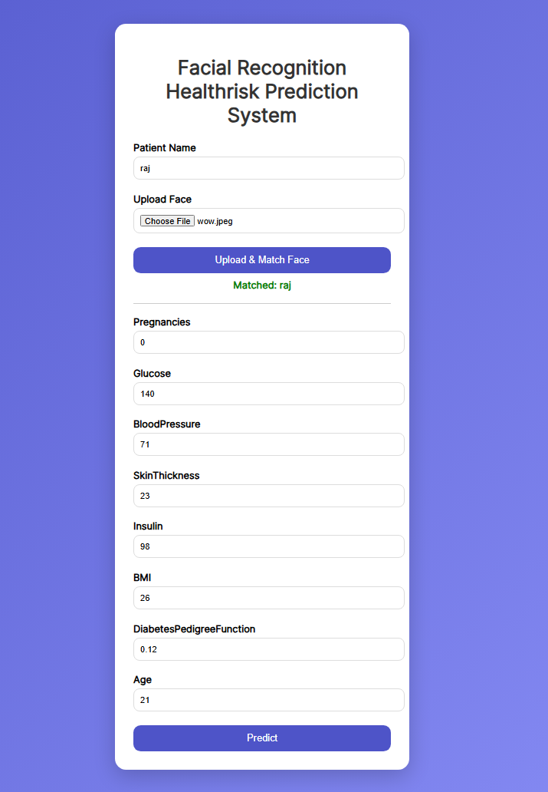
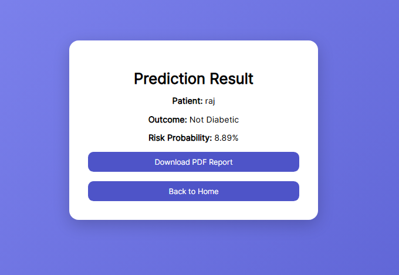
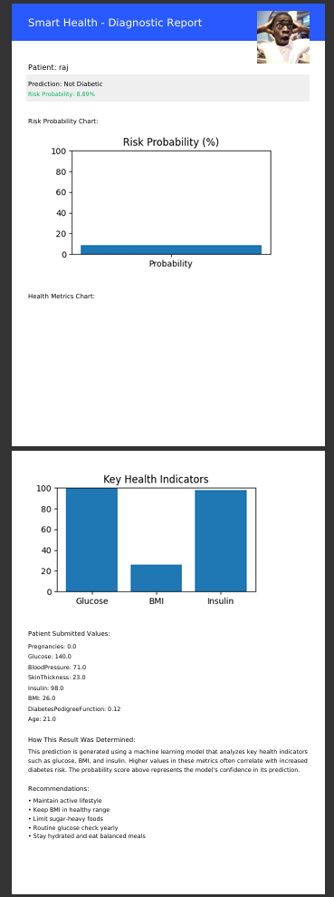

# DiabetIQ 🩺

A machine learning-powered web app for early diabetes risk detection. Built with Flask, Scikit-learn, and DeepFace — DiabetIQ lets users input clinical data, get an instant risk prediction, and download a full diagnostic PDF report.

> ⚠️ **Disclaimer:** This project was trained on a limited dataset (Pima Indians Diabetes Dataset) and is **not intended for real medical use or deployment**. DiabetIQ is a proof-of-concept that demonstrates what this kind of system could look like — a step in the right direction, not a finished product.

---

## What it does

Early diabetes detection is critical — catching risk early can completely change a patient's health outcome. DiabetIQ explores how a simple web interface backed by ML could make preliminary risk screening faster and more accessible.

---

## How it works

1. Visit the app and upload your face or fill in your clinical details (glucose, BMI, age, etc.)
2. If your face is recognized from a previous visit, your saved data loads automatically
3. If you're new, your details and face get saved for future visits
4. The model gives an instant prediction with a probability score
5. A full PDF report is generated with your result, health recommendations, key contributing factors, and graphs
6. Download the report directly from the results page

---

## Tech Stack

Python · Flask · Scikit-learn · DeepFace · OpenCV · Pandas · NumPy · Matplotlib · FPDF

---

## Screenshots

---

## Dataset

Trained on the [Pima Indians Diabetes Dataset](https://www.kaggle.com/datasets/uciml/pima-indians-diabetes-database) — 768 records, 8 clinical features.
